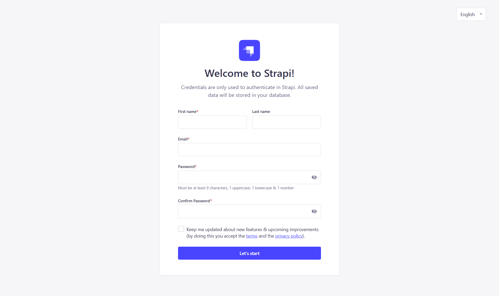
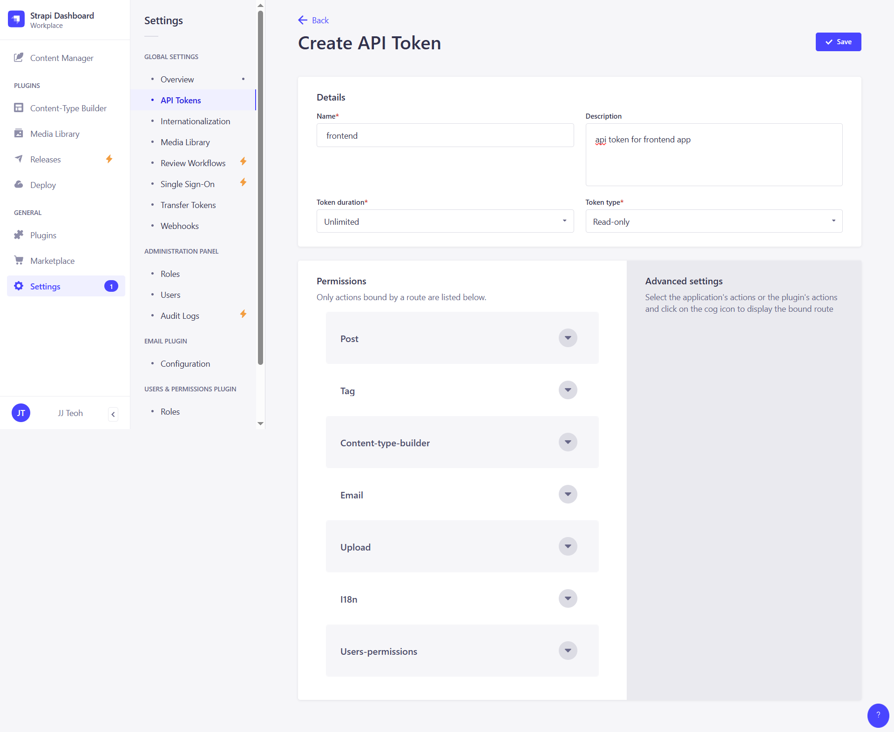

# Strapi Astro Blog

<div align="center">
    
</div>

## About Project
This is a blog application that I previously built for my own portfolio/blog(You can now follow/subscribe to my content on [Substack](https://itsjjteoh.substack.com/)). 

This project was built with Strapi as the backend headless CMS and Astro(with React extension) as the frontend framework. 

The application allows creating, managing, and displaying blog posts with a beautiful and responsive user interface.

## Tech Stack

### Backend
- **Strapi** (v4.25.8): Headless CMS for content management
- **PostgreSQL**: Database for storing content
- **AWS S3**: File Storage for uploads
- **TypeScript**: For type-safe development
- **Docker**: For containerization and deployment

### Frontend
- **Astro** (v4.14.2): Modern static site generator with islands architecture
- **React**: For interactive components
- **Tailwind CSS**: For styling
- **TypeScript**: For type-safe development
- **Docker**: For containerization and deployment

## Guide

### Prerequisites
- Node.js (>=18.0.0 <=20.x.x)
- pnpm (>=9.x.x)
- PostgreSQL (for local development, or you can use Docker)
- AWS S3 (for upload media)
- Docker & Docker Compose (for containerized deployment)

### How to Setup Locally

1. **Clone the repository**
   ```bash
   git clone <repository-url>
   cd strapi-astro-blog
   ```

2. **Backend Setup**
   ```bash
   cd backend
   cp .env.example .env  # Update with your database credentials
   pnpm install
   ```
3. **Start the Backend**
   ```bash
   cd backend
   pnpm develop
   ```
   The Strapi admin will be available at http://localhost:1337/admin

<div align="center">
    
</div>

<div align="center">
    
</div>

4. **Frontend Setup**
   ```bash
   cd front-end
   cp .env.sample .env  # Update with your Strapi API URL & API Key(login in to your Strapi admin > Settings > API Token)
   pnpm install
   ```

5. **Start the Frontend**
   ```bash
   cd front-end
   pnpm dev
   ```
   The Astro frontend will be available at http://localhost:4321

### Using Docker Compose (Optional)
To run the entire application stack using Docker Compose:

1. Configure environment files:
   - Create `.strapi.env` and `.astro.env` files in the project root
   
2. Build and start the containers:
   ```bash
   docker-compose up -d
   ```
   - Strapi backend will be available at http://localhost:3000
   - Astro frontend will be available at http://localhost:80

## License
This project is licensed under the MIT License.

## Contact
- Created by: jjteoh
- GitHub: https://github.com/jjteoh-thewebdev
- Email: thewebdev.jjteoh@gmail.com
